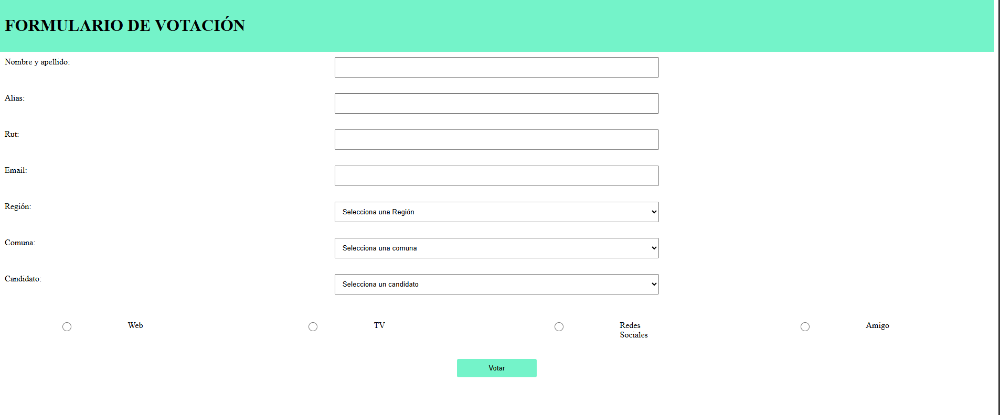

# Formulario de votación 

## Índice

* [1. Preámbulo](#1-preámbulo)
* [2. Resumen del proyecto](#2-resumen-del-proyecto)
* [3. Funcionalidades](#3-funcionalidades)
* [4. Tecnologías utilizadas](#4-tecnologías-utilizadas)

***

## 1. Preámbulo

 Los formularios digitales son una alternativa eficiente para gestionar votaciones en línea, permitiendo a 
 los usuarios participar de manera cómoda y segura a través de una plataforma web. Este tipo de soluciones 
 contribuyen a optimizar procesos y a garantizar la accesibilidad a las votaciones en distintos contextos.

## 2. Resumen del proyecto
 Este proyecto consiste en la creación de un formulario de votación en línea que permite a los usuarios 
 registrar sus votos de manera sencilla y rápida. La aplicación web gestiona la 
 autenticación de los usuarios, captura los votos y los almacena en una base de datos.

 
## 3. Funcionalidades
- Registro de usuarios.
- Envío de votos de manera segura.
- Almacenamiento de los votos en una base de datos.
- Visualización de los resultados en tiempo real para los administradores.

   
  

## 4. Tecnologías utilizadas

- JavaScript, Fetch: Para gestionar la comunicación con el servidor y la interacción con la base de datos.
- PHP: Como lenguaje para el servidor web, encargado de procesar las peticiones y manejar la lógica del back-end.
- PostgreSQL con pgAdmin: Base de datos relacional utilizada para almacenar los datos de la aplicación y gestionar la información de los votos.

